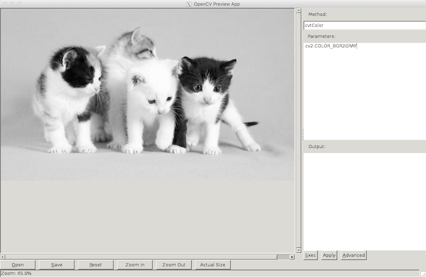
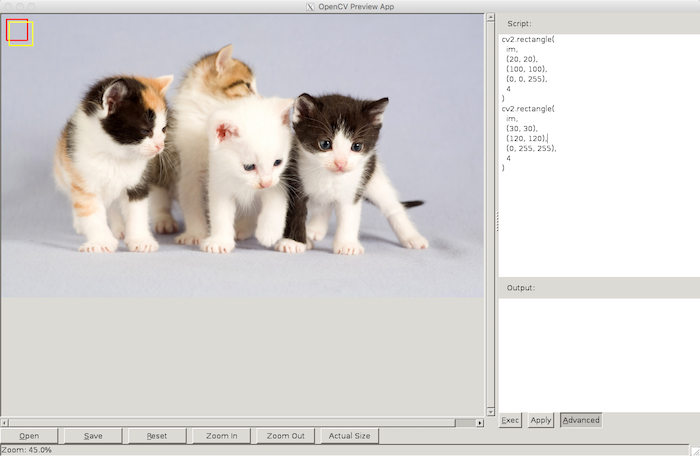
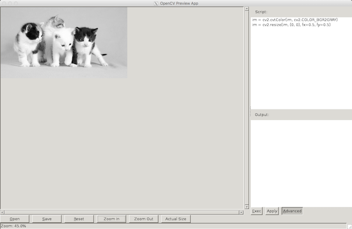

# OpenCV Preview App

a gui tool easy to try OpenCV methods to process image for developer.
It can preview result of OpenCV methods in Python Code.

## Usage

In normal mode, it can only execute methods of `cv2`. In the below image,
it equals to run `cv2.cvtColor(im, cv2.COLOR_BGR2GRAY)`.

In advanced mode, it can run any Python Code.

The objects in context that has exposed are: `cv2`, `np`, `numpy`, `os` `im`

### Shortcut Keys

* Exec: &lt;Meta&gt;+Enter / &lt;Meta&gt;+e
* Advanced: &lt;Meta&gt;+a
* Open: &lt;Meta&gt;+o
* Save: &lt;Meta&gt;+s
* Reset: &lt;Meta&gt;+r
* Zoom In: &lt;Meta&gt;+=
* Zoom Out: &lt;Meta&gt;+-
* Actual Size: &lt;Meta&gt;+0
